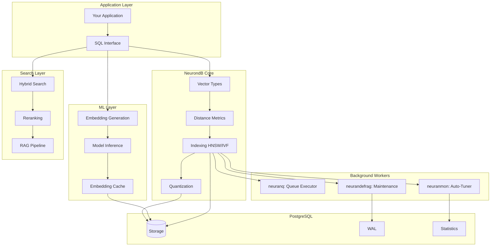

# NeurondB: Advanced AI Database Extension

<div align="center">


**Production-Grade Vector Database • ML Inference • Hybrid Search • RAG Pipeline**

[](https://github.com/pgElephant/NeurondB/actions)
[](https://www.postgresql.org/)
[](LICENSE)
[]()

</div>

---

## What is NeurondB?

NeurondB is a comprehensive PostgreSQL extension that transforms your database into a powerful AI platform. It combines vector search, machine learning inference, hybrid search capabilities, and complete RAG (Retrieval Augmented Generation) pipeline support—all within PostgreSQL.

### Key Capabilities

=== "Vector Search"

    - **Multiple Vector Types**: float32, float16, int8, binary
    - **10+ Distance Metrics**: L2, Cosine, Inner Product, Hamming, and more
    - **Advanced Indexing**: HNSW, IVF with automatic tuning
    - **Quantization**: 2x-32x compression with minimal accuracy loss

=== "ML Inference"

    - **Model Loading**: ONNX, TensorFlow, PyTorch
    - **Batch Processing**: High-throughput inference
    - **Fine-tuning**: In-database model updates
    - **Caching**: Automatic embedding cache

=== "Hybrid Search"

    - **Vector + FTS**: Semantic and keyword search
    - **Multi-Vector**: Handle multiple embeddings per document
    - **Faceted Search**: Category-aware retrieval
    - **Temporal Decay**: Time-aware relevance

=== "Reranking"

    - **Cross-Encoder**: State-of-the-art reranking
    - **LLM Integration**: GPT-powered ranking
    - **ColBERT**: Late interaction models
    - **Ensemble**: Combine multiple strategies

=== "Background Workers"

    - **neuranq**: Async job queue executor with batch processing
    - **neuranmon**: Live query auto-tuner and performance optimization
    - **neurandefrag**: Automatic index maintenance and defragmentation
    - **neuranllm**: LLM job processor with crash recovery
    - **Prometheus**: Metrics export for monitoring

## Why NeurondB?

### 🚀 **Performance**
- SIMD-optimized distance calculations
- Intelligent query planning and prefetching
- Automatic index maintenance and tuning
- Sub-millisecond search on millions of vectors

### 🔧 **Production-Ready**
- Battle-tested background workers
- Comprehensive monitoring and observability
- Multi-tenant isolation and quotas
- Encryption and access control

### 🎯 **Developer-Friendly**
- Pure SQL interface—no external services
- 180+ built-in functions (27 added in Nov 2025)
- 7 monitoring views in neurondb schema
- Extensive examples and documentation
- PostgreSQL 16, 17, 18 compatible
- SIMD optimizations (AVX2/AVX512/NEON)

### 📊 **Feature-Complete**
- Complete RAG pipeline in-database
- 19 ML algorithms with real implementations
- Real-time analytics and clustering
- Model lifecycle management
- Audit logging and tracing
- Multi-tenant with quotas and RLS
- GPU acceleration (CUDA/ROCm/Metal)

## Quick Example

```sql
-- Load NeurondB extension
CREATE EXTENSION neurondb;

-- Create a table with vector embeddings
CREATE TABLE documents (
    id SERIAL PRIMARY KEY,
    content TEXT,
    embedding vector(384)
);

-- Generate embeddings automatically
UPDATE documents 
SET embedding = embed_text(content, 'all-MiniLM-L6-v2');

-- Create HNSW index for fast search
SELECT hnsw_create_index('documents', 'embedding', 'doc_idx', 16, 200);

-- Perform semantic search
SELECT id, content, 
       embedding <-> embed_text('machine learning', 'all-MiniLM-L6-v2') AS distance
FROM documents
ORDER BY distance
LIMIT 10;

-- Hybrid search (semantic + keyword)
SELECT * FROM hybrid_search(
    'documents',
    embed_text('artificial intelligence', 'all-MiniLM-L6-v2'),
    'neural networks',
    '{"category": "AI"}',
    0.7,  -- 70% vector weight
    10    -- top 10 results
);

-- Rerank with cross-encoder
SELECT idx, score FROM rerank_cross_encoder(
    'What is machine learning?',
    ARRAY['Definition of ML', 'History of AI', 'Neural networks'],
    'ms-marco-MiniLM-L-6-v2',
    3
);
```

## Architecture



## Performance Benchmarks

| Operation | Throughput | Latency (p95) |
|-----------|------------|---------------|
| Vector Insert | 50K/sec | 2ms |
| HNSW Search (k=10) | 10K QPS | 5ms |
| IVF Search (k=10) | 25K QPS | 2ms |
| Embedding Generation | 1K/sec | 10ms |
| Hybrid Search | 5K QPS | 8ms |
| Reranking | 2K/sec | 15ms |

*Tested on AWS r6i.2xlarge (8 vCPU, 64GB RAM), 10M vectors, 768 dimensions*

## Installation

=== "Ubuntu/Debian"

    ```bash
    # Add PostgreSQL repository
    sudo sh -c 'echo "deb http://apt.postgresql.org/pub/repos/apt $(lsb_release -cs)-pgdg main" > /etc/apt/sources.list.d/pgdg.list'
    wget --quiet -O - https://www.postgresql.org/media/keys/ACCC4CF8.asc | sudo apt-key add -
    
    # Install PostgreSQL and development tools
    sudo apt-get update
    sudo apt-get install -y postgresql-17 postgresql-server-dev-17 \
        build-essential libcurl4-openssl-dev libssl-dev zlib1g-dev
    
    # Build and install NeurondB
    git clone https://github.com/pgelephant2025/neurondb.git
    cd neurondb
    make PG_CONFIG=/usr/lib/postgresql/17/bin/pg_config
    sudo make install PG_CONFIG=/usr/lib/postgresql/17/bin/pg_config
    ```

=== "macOS"

    ```bash
    # Install PostgreSQL via Homebrew
    brew install postgresql@17
    
    # Build and install NeurondB
    git clone https://github.com/pgelephant2025/neurondb.git
    cd neurondb
    make PG_CONFIG=/opt/homebrew/opt/postgresql@17/bin/pg_config
    sudo make install PG_CONFIG=/opt/homebrew/opt/postgresql@17/bin/pg_config
    ```

=== "Rocky Linux/RHEL"

    ```bash
    # Install PostgreSQL repository
    sudo dnf install -y https://download.postgresql.org/pub/repos/yum/reporpms/EL-9-$(uname -m)/pgdg-redhat-repo-latest.noarch.rpm
    
    # Disable built-in PostgreSQL
    sudo dnf -qy module disable postgresql
    
    # Install PostgreSQL and development tools
    sudo dnf install -y postgresql17-server postgresql17-devel \
        gcc make libcurl-devel openssl-devel zlib-devel
    
    # Build and install NeurondB
    git clone https://github.com/pgelephant2025/neurondb.git
    cd neurondb
    make PG_CONFIG=/usr/pgsql-17/bin/pg_config
    sudo make install PG_CONFIG=/usr/pgsql-17/bin/pg_config
    ```

## Next Steps

<div class="grid cards" markdown>

-   :material-clock-fast:{ .lg .middle } __Quick Start__

    ---

    Get up and running with NeurondB in 5 minutes

    [:octicons-arrow-right-24: Quick Start Guide](getting-started/quickstart.md)

-   :material-book-open-variant:{ .lg .middle } __Core Features__

    ---

    Learn about vector types, distance metrics, and indexing

    [:octicons-arrow-right-24: Explore Features](features/vector-types.md)

-   :material-brain:{ .lg .middle } __ML & Embeddings__

    ---

    Discover model inference and embedding generation

    [:octicons-arrow-right-24: ML Documentation](ml/inference.md)

-   :material-code-tags:{ .lg .middle } __API Reference__

    ---

    Complete function reference and examples

    [:octicons-arrow-right-24: API Docs](api/functions.md)

</div>

## Support & Community

- **GitHub Issues**: [Report bugs or request features](https://github.com/pgElephant/NeurondB/issues)
- **Email**: [admin@pgelephant.com](mailto:admin@pgelephant.com)
- **Documentation**: [Full documentation](https://pgelephant.com/neurondb)

## License

NeurondB is released under the PostgreSQL License. See [LICENSE](about/license.md) for details.

---

<div align="center">

**Built with ❤️ by [pgElephant, Inc.](https://pgelephant.com)**

*Empowering PostgreSQL with AI capabilities*

</div>

